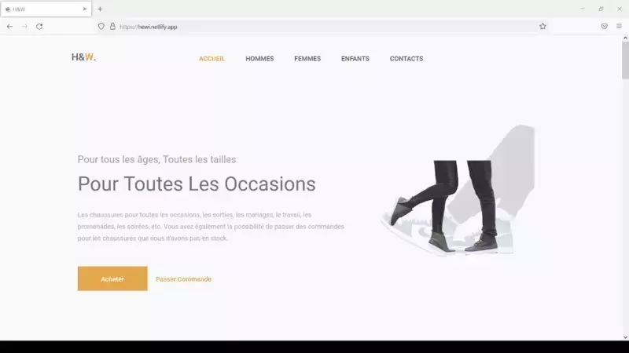
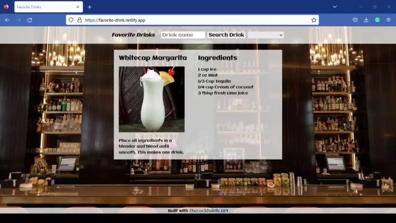

<!--Introduction-->

  
  
  
  

<h2 align="center">Hi 👋, I'm Augustin</h2>

A software engineer specializing in MERN stack, MongoDB, Express, React, and Node. I am proficient in using HTML, CSS, and Javascript to build and enhance websites and web applications that impact the end-user experience. 
  
In university, I studied applied linguistics, focusing on society's complex areas in which language plays a role and finding practical ways to solve problems. Having used different software and browsed several websites in my previous roles, I can think and build with the business goals and user in mind.

<!--Projects-->
<h2 align="center">Projects</h2>
<table bordercolor="#66b2b2">
    <tr>
        <td width="50%" valign="top">
            <h3 align="center">H&W</h3>
             
            
             
            

                
                
            

            
HTML5, CSS3, Javascript, & Font Awesome. Website to help a local shoe seller get more exposure.

        </td>
        <td width="50%" valign="top">
            <h3 align="center">Project Title</h3>
             
            
             
            

                
                
            

            
Project description. Lorem ipsum dolor sit amet, consectetur adipiscing elit, sed do eiusmod tempor incididunt ut labore et dolore magna aliqua.

        </td>
    </tr>
    <tr>
        <td width="50%" valign="top">
            <h3 align="center">Project Title</h3>
             
            
             
            

                
                
            

            
Project description. Lorem ipsum dolor sit amet, consectetur adipiscing elit, sed do eiusmod tempor incididunt ut labore et dolore magna aliqua.

        </td>
        <td width="50%" valign="top">
            <h3 align="center">Project Title</h3>
             
            
             
            

                
                
            

            
Project description. Lorem ipsum dolor sit amet, consectetur adipiscing elit, sed do eiusmod tempor incididunt ut labore et dolore magna aliqua.

        </td>
    </tr>
</table>

<!--Technologies-->
<h2 align="center">Technologies</h2>

    
    
    
    
    
    
    
    
        
<!--Socials-->
<h2 align="center">Let's Connect</h2>

  
  
  
  

